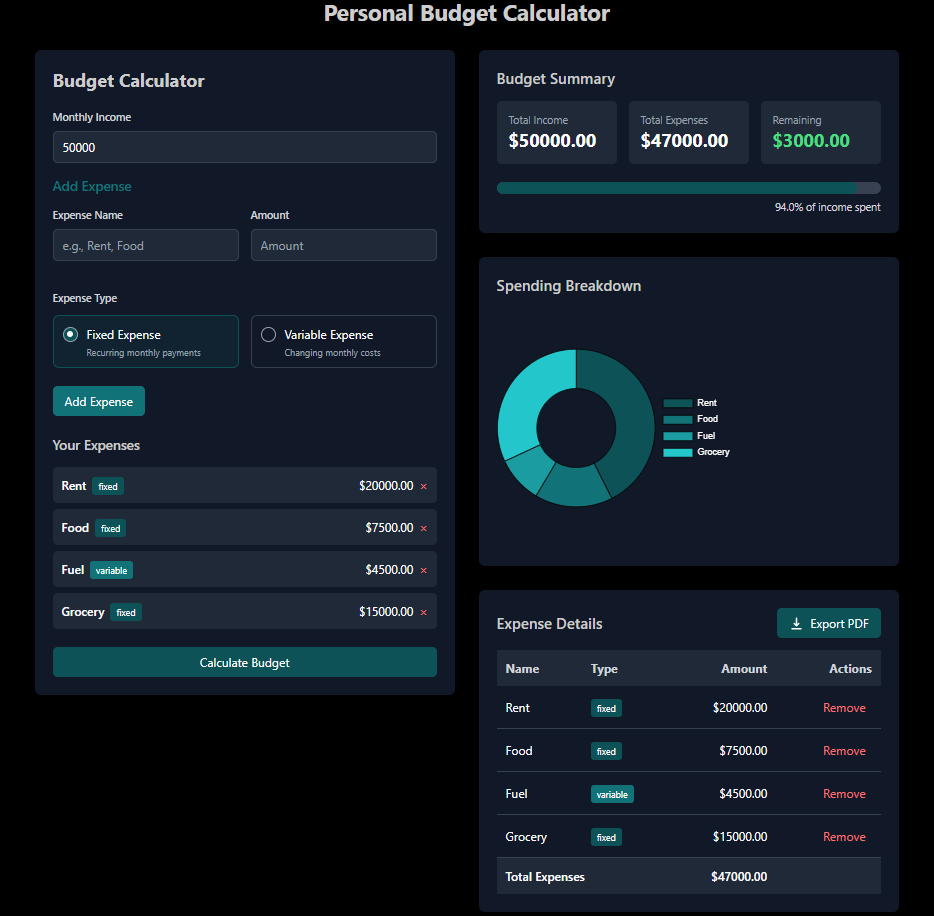

# 💰 Personal Budget Calculator

A sleek and interactive budget calculator built using **Next.js**, **TypeScript**, and **Tailwind CSS**. This app helps you easily track your monthly income, manage fixed and variable expenses, and visualize your spending — all with a modern UI and the ability to export your report as a PDF.



Live Demo: [stockfolio-calculator.vercel.app/](https://stockfolio-calculator.vercel.app/)

---

## ✨ Features

- ✅ Add and categorize **fixed** and **variable** expenses
- 📊 Real-time **budget summary** and **spending breakdown chart**
- 🧮 Automatic calculation of total expenses and remaining balance
- 📄 **Export expenses as PDF**
- ⚡ Clean, responsive, and dark-themed UI

---

## 🚀 Tech Stack

- **Framework:** [Next.js](https://nextjs.org/)
- **Language:** [TypeScript](https://www.typescriptlang.org/)
- **Styling:** [Tailwind CSS](https://tailwindcss.com/)
- **Charting:** [Recharts](https://recharts.org/)
- **PDF Export:** [jsPDF](https://github.com/parallax/jsPDF)

---

## 📦 Installation

```bash
git clone https://github.com/Alirazahaider/personal-budget-calculator.git
cd personal-budget-calculator
npm install
npm run dev
```

## 💌 Get In Touch

Thank you for checking out this project! If you have any questions, suggestions, would like to collaborate, or need my development services:

[](mailto:alicodespace@gmail.com)
[](https://www.linkedin.com/in/alirazaweb)
[](https://alicodez.vercel.app/)

⭐ Support the project by starring the repository!
[](https://github.com/Alirazahaider/personal-budget-calculator)
